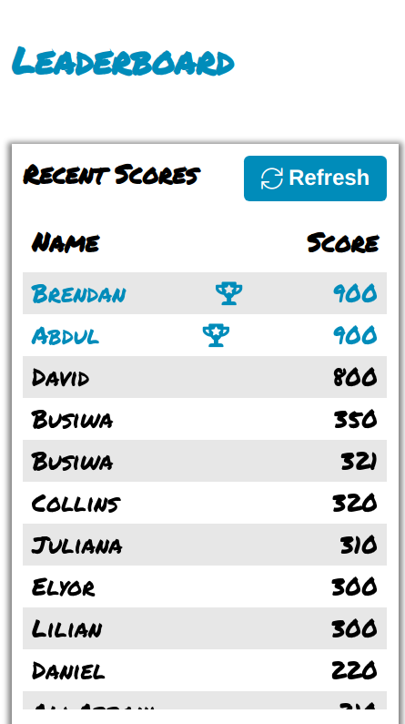

# leaderboard
This is a leader board project that takes the scores of different players and sort the scores in an ascending order. This helps to determine the leader from all the scores at all times. 

## Built With

- HTML
- CSS
- JavaScript
- Webpack

## Live Demo

The app is deployed using GitHub pages. You can view it using the 'live demo' below.

[Live Demo Link](https://henrykc24.github.io/leaderboard/dist/)

## Getting Started

To get a local copy up and running follow these simple example steps.

Clone the repo with `git clone https://github.com/HENRYKC24/leaderboard.git`

Run `npm install` from the command line

Run `npm run build` to get the app up and running.

## Author

👤 **Henry Kc**

- GitHub: [@githubhandle](https://github.com/henrykc24)
- Twitter: [@twitterhandle](https://twitter.com/henrykc24)
- LinkedIn: [LinkedIn](https://linkedin.com/in/henry-kc)

## 🤝 Contributing

Contributions, issues, and feature requests are welcome!

Feel free to check the [issues page](https://github.com/HENRYKC24/leaderboard/issues/).

## Show your support

Give a ⭐️ if you like this project!

## Acknowledgments

- A special thanks to Microverse for inspiring this project. I indebted to you all at Microverse Inc.
- A special thanks goes to all my peers at Microverse for being ther for me.

## 📝 License

This project is [MIT](./LICENSE) licensed.

